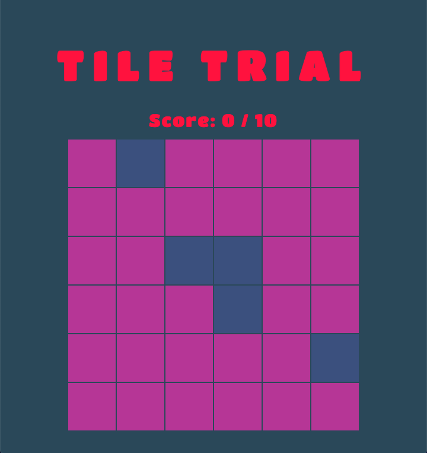

# TILE TRIAL
## A Memory Game

### INSTRUCTIONS

There are sixteen tiles on the board. When you start the game, five random tiles will flip. Click the same tiles and you gain a point! When you hit ten points, you win.

### GAME INFO

This game was built with <b>JavaScript</b>, <b>HTML</b>, and <b>CSS</b>.

In the future, I would like to include several levels that get harder each time.

### PLAY

Play the game <a href="https://maddyrombes.github.io/tile-trial/">here!</a>

You can play it on your phone, too! I will soon implement a more responsive design.

  

